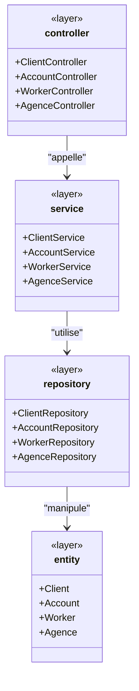
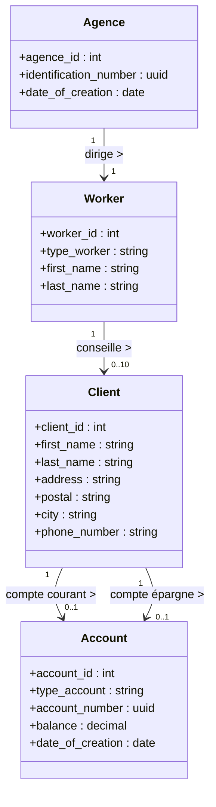

# projet_sk-peermahomed_nazif

# UML – Architecture du projet SimpleCash

Ce diagramme représente l’architecture en couches du projet Spring Boot :  
**Controller → Service → Repository → Entity**


---

# **2) Fichier : `uml-domain-model.md`**

```markdown
# UML – Vue Simplifiée des Classes Métier

Ce diagramme représente uniquement les **entités métier** et leurs **relations**.
```
